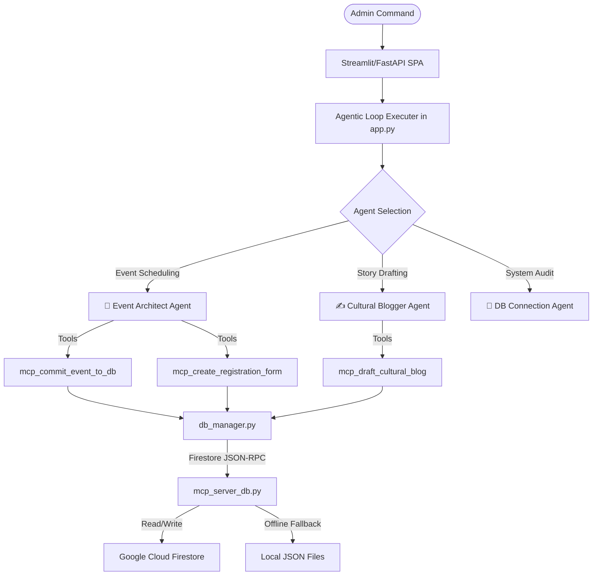

# Kaggle Submission Portfolio Writeup
## Project Title: Multi-Agent Digital Portal — North West Marathi Association (NORWEMA)

---

## 1. Executive Summary
The **North West Marathi Association (NORWEMA)**, established in 1973, is a community organization in the North West of England supporting Maharashtrian heritage. This project delivers a production-grade, refactored Single Page Application (SPA) portal integrated with a specialized multi-agent framework. By leveraging Google Cloud Run, Cloud Firestore Native Mode, Stripe payment gateways, and the `google-genai` SDK, the portal allows administrators to schedule community events and draft cultural publications using intelligent agents, while providing users with a seamless, responsive event registration and payment process.

---

## 2. Multi-Agent Taxonomy & Architecture

The portal employs a multi-agent framework where each agent has a distinct role, context, and toolset. The system ensures robust execution by using structured prompt guidelines and forced tool calling capabilities.

### Specialized Agents:
1.  **📅 Event Architect Agent**
    *   **Role:** Interprets unstructured natural language commands (e.g., *"Schedule Ganesh Utsav on August 2026 with a £25 ticket fee"*), parses parameters (title, date, description, and fee), and structures them into databases.
    *   **Tools:** `mcp_commit_event_to_db` (commits event data) and `mcp_create_registration_form` (provisions the registration schema).
    *   **Prompt System:** Defined in [EventPlannerSkill.md](file:///c:/Users/RUSHI/.gemini/antigravity-ide/scratch/norwema_agent_portal/skills/EventPlannerSkill.md).

2.  **✍️ Cultural Blogger Agent**
    *   **Role:** Drafts and publishes cultural announcements and historical blogs. Operates with a respectful, community-focused, and narrative tone representing Marathi culture.
    *   **Tools:** `mcp_draft_cultural_blog` (saves blog drafts and content).
    *   **Prompt System:** Defined in [MarathiCultureSkill.md](file:///c:/Users/RUSHI/.gemini/antigravity-ide/scratch/norwema_agent_portal/skills/MarathiCultureSkill.md).

3.  **💾 DB Connection Agent**
    *   **Role:** Performs audits on active collections, prints metrics (count of events, blogs, registrations), and runs database cleanup/resets.
    *   **Tools:** Relies on direct query operations and `cleanup_db` routines.

### Human-Centric Design: Empowering Non-Technical Admins
Community organizations like NORWEMA are driven by passionate volunteers who often lack formal software engineering or database management skills. Traditional web administration is highly error-prone, requiring volunteers to navigate database consoles, manually map schemas, configure Stripe product pages, and write HTML/Markdown drafts. 

The **Event Architect** and **Cultural Blogger** agents simplify work by introducing a **Plain English Interface**:
*   **Unstructured Prompts to Structured Data:** Volunteers don't need to fill out complex forms or write SQL queries. They simply command the agent in natural English (e.g., *"Post a blog about Diwali and write a warm welcome in Marathi"* or *"Schedule our yearly meeting on Sept 10 at 4pm and make it free"*).
*   **Automated Schema Provisioning:** The Event Architect Agent automatically inserts the event details, calculates pricing structures, and provisions the Stripe Checkout configuration (or completely bypasses Stripe when tickets are £0).
*   **Narrative & Tone Consistency:** The Cultural Blogger Agent automatically formats post summaries, translates headers to Devnagari Marathi, and generates styled cultural cards based on simple, plain-text prompts.
*   **Transparency & Trust:** The portal renders real-time agent reasoning logs and database traffic (JSON-RPC). Non-technical administrators see exactly how the agent works under the hood, building user trust without requiring any coding knowledge.

---

## 3. Design Rationale

*   **FastAPI & Vanilla CSS SPA:**
    *   FastAPI provides a high-performance, asynchronous backend with automatic OpenAPI schema generation and Pydantic validation.
    *   The frontend uses a Single Page Application (SPA) structure styled with Vanilla CSS to achieve premium aesthetics (rich gradients, transitions, and clean typography) without the overhead or design uniformity of TailwindCSS.
*   **Google Cloud Firestore (Native Mode):**
    *   A serverless, document-oriented NoSQL database that automatically handles scaling, scales to zero to minimize costs, and integrates directly with GCP IAM service accounts.
*   **Model Context Protocol (MCP) Design Pattern:**
    *   The database layer ([mcp_server_db.py](file:///c:/Users/RUSHI/.gemini/antigravity-ide/scratch/norwema_agent_portal/mcp_server_db.py)) simulates an MCP server, exposing JSON-RPC-like tools. This decouples the agent's database interactions from raw client queries, keeping tool definitions clean and modular.
*   **Stripe Sandbox Checkout:**
    *   Integrates Stripe Checkout Sessions for registration fee processing. It detects local/missing keys and automatically drops back to a Simulated Stripe Sandbox page, enabling end-to-end verification without real transactions.

---

## 4. Technical Execution & Agentic Loop

### Google GenAI SDK Agentic Loop:
In `run_live_agent` within [app.py](file:///c:/Users/RUSHI/.gemini/antigravity-ide/scratch/norwema_agent_portal/app.py), a multi-round execution loop is implemented to guarantee that agents execute their assigned tools rather than simply outputting conversation:
1.  **Forced Tool Call (Round 1):** The model is configured with `tool_config` setting `mode="ANY"`, forcing it to select and execute one of the registered python functions.
2.  **Autonomous Flow (Rounds 2-4):** Subsequent calls use `mode="AUTO"` to handle multi-step actions.
3.  **Summary Generation (Final Round):** Once tools are dispatched, tool usage is disabled by setting `mode="NONE"`. This forces the model to summarize the actions in natural language for the user interface.

### Context-Scoped Logging Middleware:
To provide users and administrators with complete transparency, a FastAPI middleware captures all database traffic during a request:
*   A `contextvars.ContextVar` (`mcp_logs_var`) is initialized on every HTTP request.
*   All tool calls made by the agents write their JSON-RPC requests/responses to this thread-safe context.
*   The API returns this log log trace in the HTTP response, which is rendered in real-time on the Agent Console.

### State Recovery from Memory:
Because all agent actions are logged and immediately committed to Firestore (or local JSON fallback), the application is fully stateless. If a container instance restarts, state is immediately recovered upon the next database query, ensuring zero data loss and persistent session states.

---

## 5. Engineering with the AI Coding Agent (Antigravity)

The entire application was built, debugged, and deployed in collaboration with **Antigravity**, an agentic AI coding assistant. This co-development model highlights how modern software engineering can be accelerated through LLM-driven tooling:

*   **Rapid Prototyping & Building:** Scaffolded the FastAPI SPA backend layout, designed responsive CSS transitions/animations, integrated Google GenAI SDK, and established the Database MCP Server layer.
*   **Intelligent Debugging & Refactoring:**
    *   **Duplicate Prevention:** Resolved issues with duplicate blog postings by refactoring logic to verify existence before database writes.
    *   **Free Ticket Logic:** Debugged the Stripe integration flow where free events (cost of £0) were incorrectly defaulting to standard fees. The agent corrected the checkout behavior to instantly skip payments and mark registration as `Paid`.
    *   **Fallback Resilience:** Implemented and tested the offline fallback mechanism that switches Firestore writes to local JSON schemas if Google Cloud credentials or network connections are unavailable.
*   **Streamlined Deployment Pipelines:** Created the container configuration [Dockerfile](file:///c:/Users/RUSHI/.gemini/antigravity-ide/scratch/norwema_agent_portal/Dockerfile), wrote the step-by-step [deployment_guide.md](file:///c:/Users/RUSHI/.gemini/antigravity-ide/scratch/norwema_agent_portal/deployment_guide.md), and generated the exact `gcloud` commands needed to deploy to Cloud Run, configure Secret Manager, and assign Datastore/Firestore permissions.
*   **UX Verification:** Utilized browser automation tools to simulate real user clickstreams on the portal, verifying the UI look and feel and ensuring forms are responsive and accessible.

---

## 6. Live Demo & Verification
*   **Live App URL:** [https://norwema-app-692906504234.europe-west2.run.app](https://norwema-app-692906504234.europe-west2.run.app)
*   **Deployment Environment:** Containerized using Docker ([Dockerfile](file:///c:/Users/RUSHI/.gemini/antigravity-ide/scratch/norwema_agent_portal/Dockerfile)) and deployed serverless on Google Cloud Run in the `europe-west2` region.
*   **Secrets Manager:** Gemini API keys are retrieved securely at runtime from Google Cloud Secret Manager.
*   **Verification:** Administrators can log in, select the Event Architect or Cultural Blogger agents, command them to perform actions, watch the database update in real-time, and register for events through the dynamic multi-step form with mock payment processing.

### Portfolio Submission Media Assets
To complete the Kaggle submission, attach the following assets from the repository root:
*   **Card Banner (Cover Image):** [kaggle_card_banner.png](file:///c:/Users/RUSHI/.gemini/antigravity-ide/scratch/norwema_agent_portal/kaggle_card_banner.png) (Interconnected AI agent nodes and Marathi cultural motifs).
*   **Thumbnail Image:** [kaggle_thumbnail.png](file:///c:/Users/RUSHI/.gemini/antigravity-ide/scratch/norwema_agent_portal/kaggle_thumbnail.png) (Modern tech logo icon with Devnagari Marathi letter 'न').
*   **Walkthrough Animation Video:** Convert the WebP animation to MP4 using Kapwing/Canva/Kap and attach the video showing the agentic loop, database telemetry, and mock Stripe checkout.
*   **Additional Screenshots:** 
    *   [norwema_banner_v2.png](file:///c:/Users/RUSHI/.gemini/antigravity-ide/scratch/norwema_agent_portal/norwema_banner_v2.png) (Responsive portal UI banner).
    *   [norwema_logo_new.png](file:///c:/Users/RUSHI/.gemini/antigravity-ide/scratch/norwema_agent_portal/norwema_logo_new.png) (Brand assets).

